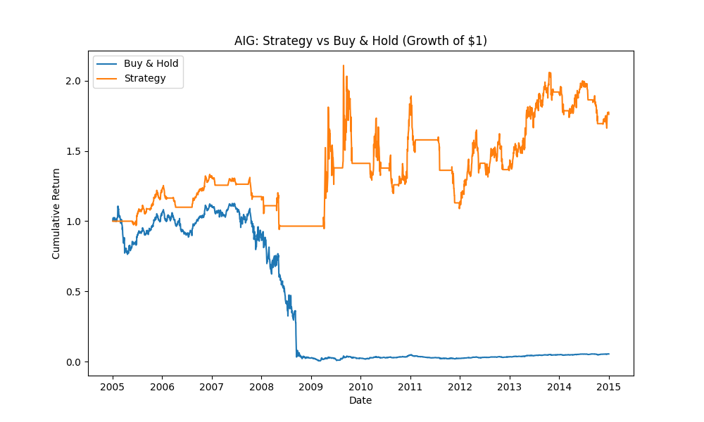
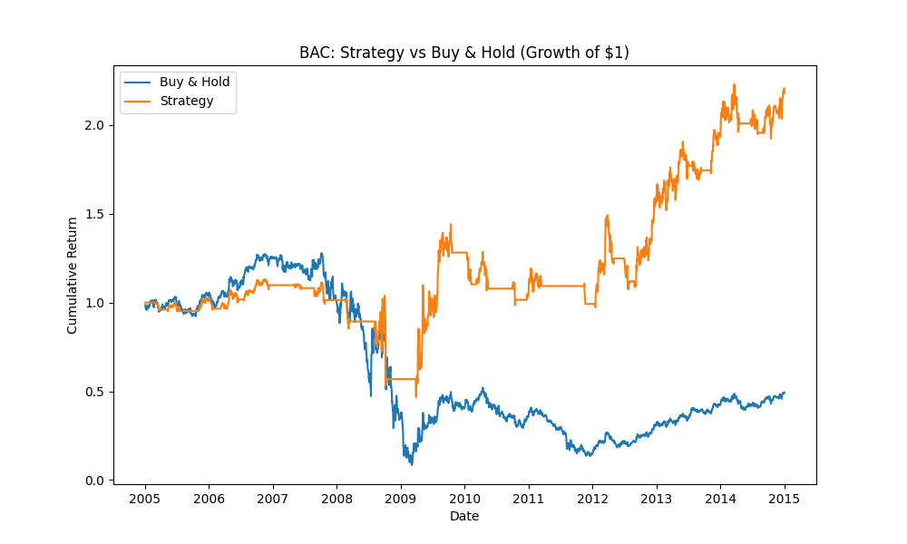
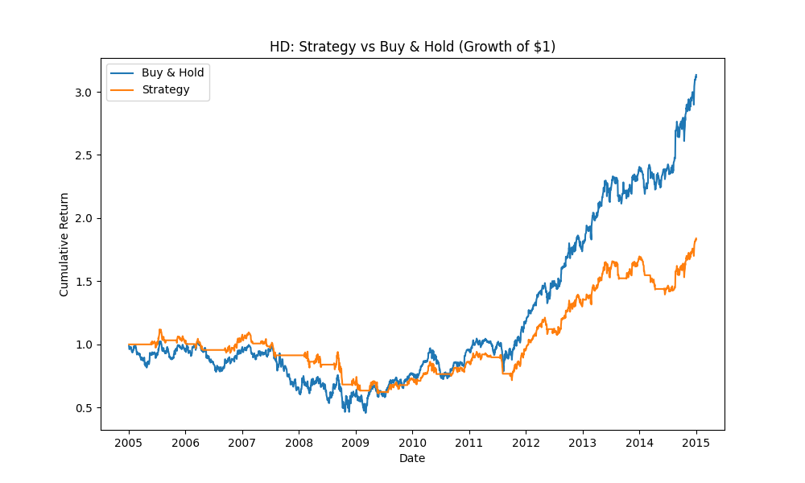

# Momentum Backtest: Moving Average Crossover Strategy

A backtested moving-average crossover (momentum/trend-following) trading strategy, tested against buy-and-hold across 12 stocks spanning 9 sectors, with a focus on performance during the 2005–2015 period, testing the strategy's resiliance to a global financial crisis.

## Summary

| Ticker | Strategy Total Return | Buy & Hold Total Return | Strategy Sharpe | Buy & Hold Sharpe | Strategy Max Drawdown | Buy & Hold Max Drawdown |
|---|---|---|---|---|---|---|
| BAC  | **+117.8%** | -51.1%  | **0.399**  | 0.163 | **-58.7%** | -93.4% |
| C    | **-55.8%**  | -86.5%  | -0.162 | **-0.028** | **-77.7%** | -98.0% |
| GE   | **+1.6%**   | -1.7%   | 0.096  | **0.148** | **-35.5%** | -82.7% |
| MSFT | -1.3%   | **+14.9%**  | **0.479**  | 0.418 | **-26.8%** | -57.9% |
| F    | **+115.7%** | +22.3%  | **0.409**  | 0.278 | **-72.3%** | -90.8% |
| T    | -34.5%  | **+63.2%**  | -0.116 | **0.548**  | **-30.4%** | -44.4% |
| AIG  | **+76.1%**  | -94.6%  | **0.335**  | 0.016 | **-48.3%** | -99.5% |
| LEN  | -28.4%  | **-9.3%**   | -0.163 | **0.271**  | **-80.2%** | -94.3% |
| AA   | **-1.2%**   | -39.2%  | **0.128**  | 0.110 | **-68.8%** | -88.3% |
| LUV  | **+200.8%** | +171.9% | **0.603**  | 0.465 | **-36.8%** | -72.3% |
| HD   | -16.1%  | **+113.4%** | -0.118 | **0.551**  | **-45.4%** | -55.6% |
| NEM  | -59.0%  | **-48.4%**  | -0.242 | **0.032** | **-66.4%** | -73.3% |

*(Bold = better-performing side for that metric. Sharpe ratios and returns are annualised where applicable; see Methodology.)*

**Headline result:** the strategy reduced maximum drawdown from a baseline buy-and-hold strategy in **12 of 12 stocks tested (100%)**. It produced higher total return in 7 of 12 cases and a higher Sharpe ratio in 6 of 12 cases.

## Methodology

- **Strategy:** a simple moving-average crossover. A 20-day simple moving average (SMA) is compared to a 50-day SMA. When the short-term average is above the long-term average, the strategy holds a full (100%) position in the stock; otherwise it holds cash. This produces a binary long/flat signal — no shorting, no partial position sizing.
- **Data:** daily adjusted close prices (dividend- and split-adjusted) pulled via the `yfinance` API, covering 1 January 2005 to 1 January 2015.
- **Backtest logic:** signals are generated using each day's closing price, then applied to the *following* day's return (a one-day lag) to avoid lookahead bias — the strategy cannot trade on information it wouldn't have had in real time.
- **Metrics:** Total Return, CAGR (annualised return), annualised Volatility, Sharpe Ratio (return per unit of risk, assuming a 0% risk-free rate), Maximum Drawdown (worst peak-to-trough decline), and Win Rate (% of invested days with a positive return).
- **Universe:** 12 large, liquid, continuously-listed US stocks selected *before* running the backtest, spanning Financials, Industrials, Technology, Airlines, Materials, Telecom, Insurance, Homebuilding, and Retail — chosen to avoid sector concentration and survivorship bias.

**AIG** — the clearest example of the strategy's crisis-protection effect:
 

 
**BAC** — strategy significantly outperformed through the 2008 crash and recovery:
 

 
**HD** — an example where buy-and-hold won, included for balance:
 

 
*Charts for all 12 tickers are available in the `results/` folder.*

## Findings

The results support a well-documented property of trend-following strategies: they excel at capital preservation during sustained downturns, at the cost of underperforming during periods of steady growth.

- **Crisis protection was the strategy's clearest strength.** On the most crisis-exposed names — AIG, BAC, C, and F — the strategy avoided the majority of the 2008–2009 collapse by exiting on the downward crossover, producing dramatically better drawdowns and, in most cases, better total returns than simply holding through the crash.
- **On steadier, less volatile stocks (MSFT, T, HD), buy-and-hold generally won on total return**, since the strategy occasionally exited during temporary pullbacks and re-entered late, missing some of the recovery — a known weakness of moving-average strategies in choppy or steadily-trending conditions (sometimes called "whipsaw").
- **Risk-adjusted performance (Sharpe ratio) was genuinely mixed** (6 wins each), showing that reduced volatility does not automatically translate into a better risk-adjusted return — a useful reminder that drawdown protection and Sharpe ratio measure different things.

## Limitations

- **No transaction costs or slippage are modelled.** The strategy trades relatively infrequently, but real-world costs would reduce returns on both sides, and disproportionately affect the strategy given its periodic re-entries.
- **Binary position sizing.** The strategy is always either 100% invested or 100% in cash; it does not scale position size with signal strength or volatility, which a more sophisticated strategy might do.
- **Parameter choice was not optimised on this data.** The 20/50-day windows are a standard textbook choice, deliberately not tuned to this specific sample, to avoid overfitting/curve-fitting to historical noise. Performance may differ meaningfully with different window lengths.
- **Single strategy type, single asset class.** Results are specific to a moving-average crossover on single-name equities; they should not be generalised to other strategy types, asset classes, or time periods without further testing.
- **Sample period.** The 2005–2015 window specifically includes the 2008 crisis, which likely flatters a trend-following approach; results for the same strategy over 2015–2024 (a sustained bull market) showed the opposite pattern — buy-and-hold outperforming in most cases — reinforcing that the strategy's edge is regime-dependent, not universal.

## Project Structure

```
momentum-backtest/
├── data/               # downloaded price data (CSV, via yfinance)
├── results/            # saved equity curve charts per ticker
├── data_loader.py      # downloads and cleans historical price data
├── strategy.py         # generates moving-average crossover signals
├── backtest.py         # runs the backtest and computes returns
├── metrics.py          # computes performance statistics and plots results
└── README.md
```

## How to Run

```bash
pip install -r requirements.txt
python data_loader.py    # downloads and cleans price data
python metrics.py        # runs the backtest, prints stats, saves charts
```

## Example Output

See `results/` for equity curve charts comparing strategy vs. buy-and-hold for each ticker. Notable examples: `metrics_curve_AIG.png` and `metrics_curve_BAC.png` show the clearest crisis-protection effect.


